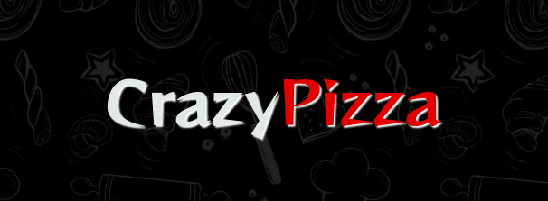
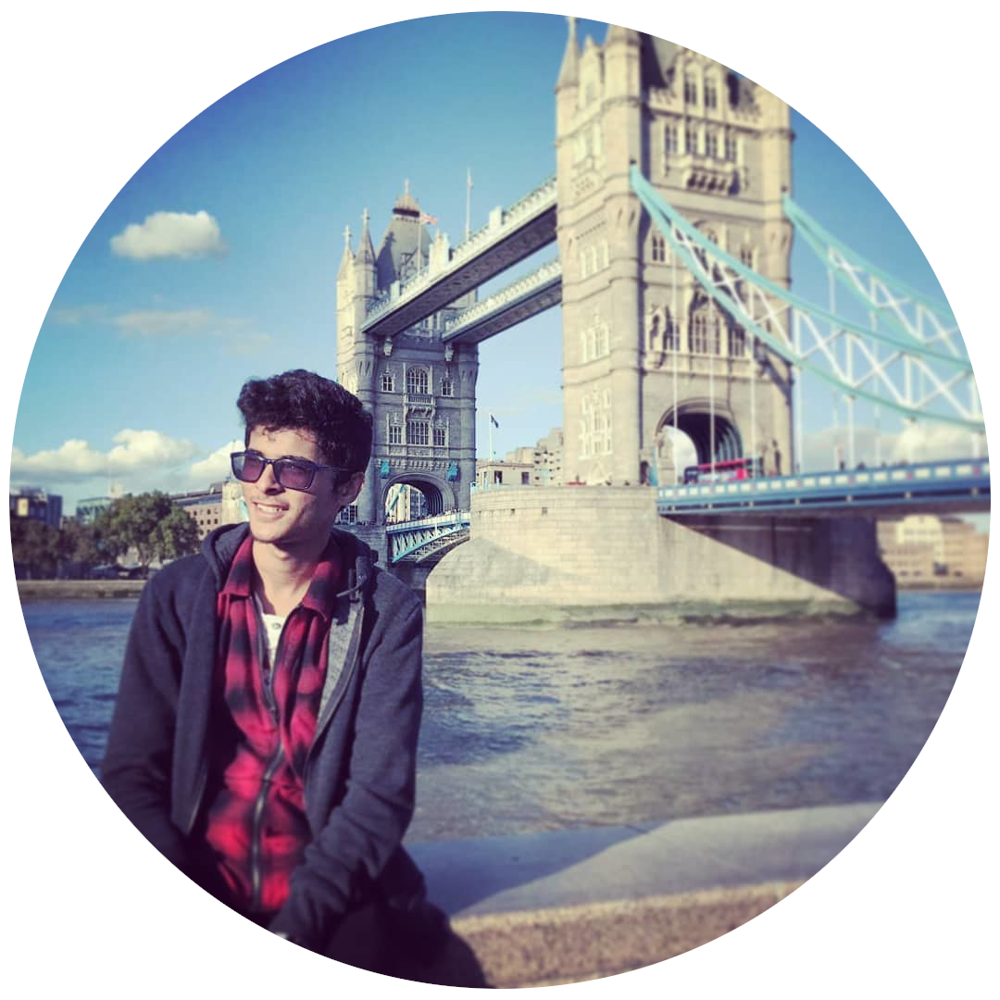

  

 🚧 Em Desenvolvimento 🚧 
 

### 💻 Descrição :
O projeto CrazzyPizza é um desafio pessoal de criar uma identidade web para uma pizzaria, na qual os usuários podem  desde de visualizar o cardápio online até mesmo realizar o pedido de uma pizza .

 

---

 

### ⚙️ Funcionalidades :
- [x] FrontEnd
- [x] Responsividade 
- [x] Validação de formulário
- [ ] Integração com banco de dados
- [ ] Cadastrar e exibir um pedido

 

---

 

### 🛠 Tecnologias :

As seguintes ferramentas foram usadas na construção do projeto:

- HTML
- CSS
- JavaScript
- [Bootstrap 5](https://getbootstrap.com/)
- [fontAwesome](https://fontawesome.com/)
- [Animate.css](https://animate.style/)
- [wow.js](https://wowjs.uk/)

 

---

 

### 🎨 Aplicação :

 

---

 

### 🦸 Autor :

 
  
 <b>Adrian Araujo</b> 🚀

  
Entre em contato!

   
  
  

